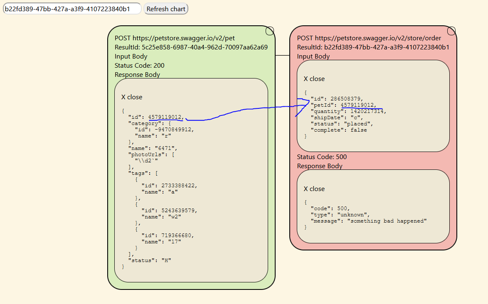

# RestShaper
- [RestShaper](#restshaper)
  - [Summary](#summary)
    - [So what? That's easy.](#so-what-thats-easy)
    - [How to use it](#how-to-use-it)
    - [How does it work?](#how-does-it-work)
  - [API spec](#api-spec)

## Summary

RestShaper is a service that generates data to test REST APIs based on an OpenApi (AKA Swagger) specification, similar to fuzz testing.

### So what? That's easy.

There are a few big problems with traditional methods of generating test data:

1) *Random data is rarely useful for functional testing.* 
   * The domain of, for example, strings you can generate for a string field is so large compared to the number of valid string, you will never get a valid string. This isn't a problem for fuzz testing since that is often just scanning for security issues or weird invalid cases. 
2)  *It's difficult to know if a test has passed or failed.*
    * With normal random testing, if your API returns a 400, is that OK? It's hard to know. If it's invalid data that is correct, but if you get a 400 with valid data that's a big problem.

RestShaper attempts to salve this by saving and reusing the results of the API calls it has made in the past. This alows RestShpaer to generate known valid and invalid data, and pass random data through multiple API calls chained together. Doing this, RestShaper can generate true API workflow tests, instead of spamming a single api with tons of data that is doomed to fail.

Instead of flat tests on each API indepentently, Rest**Shape**r can test all APIs in a specificication together to understand the **shape** of the REST API.


### How to use it

1) Use the `/run` API to trigger a test. For example, the following test will run 5 cases on both the GET and POST `/pet` endpoints in the example swagger doc because `numcases` is 5. 
   * It will then repeat this process twice due to `chainDepth`(for a total of 3 runs) So, 15 calls will be run on both endpoints for a total of 30 api calls. 
   * `chainDepth` should be used to let every endpoint run before each other endpoint. For example, if `chainDepth` was 1, the POST call would not be able to use any of the results from the GET call. However, with `chainDepth` > 1, each endpoint will be called 5 times before the second iteration, so the second iteration of the POST call has some examples the use. The third iteration has even more examples.
   * The return is an identiier for the run you can use for reviewing results.

```json
{
  "numCases": 5,
  "chainDepth": 3,
  "swaggerLocation": "https://petstore.swagger.io/v2/swagger.json",
  "endpoints": [
    {
      "method":  "POST",
      "path": "/pet"
    },
    {
      "method":  "GET",
      "path": "/pet/{petId}"
    }
  ]
}
```
2) Use the `/status` API to retrieve the status of the current test. It will be either `IN_PROGRESS` or `DONE`.
   * When it is `DONE` it will also return a list of IDs as well as the URL and status code. Each entry in this list is a call that was made in the run. Use the `resultId` to look up details of the test. For example, you may want to investigate a 500 status code.
3) Access the homepage in your browser and enter the result ID to view the results. Click the circle in the upper right to expand the call tree to see the full workflow that was run! Notice that it will resue the output from the linked APIs in the later APIs.



   
### How does it work?

WIP - 
#1 from above is essentially complete but #2 needs some work. Will update more once complete, but you can see the OpenAPI spec below for information on how to use it.


## API spec
WIP - will be updated with the correct server when hosted.

To view the OpenAPi spec check out https://petstore.swagger.io/. Paste `https://raw.githubusercontent.com/DocksonWedge/RestShaperDocs/main/OpenApi.yml` into the top field and press explore to view the api.